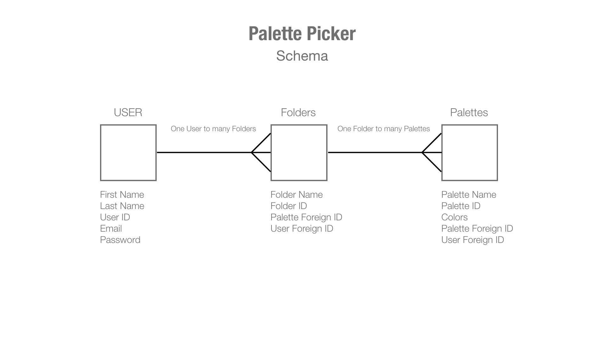

# Colors by Picasso

By:
[Matthew Malone](https://github.com/matthewdshepherd) & [Edwin Del Bosque](https://github.com/edwindelbosque)

## [Colors By Picasso - Front End](https://matthewdshepherd.github.io/whalewatchers/)

## Table of Contents
* [Schema](#Schema)
* [End Points](#End-Points)
* GET Endpoints
* POST Endpoints
* DELETE Endpoints
* [API's used](#API's-used)
* [Project Management Board](#Project-Management-Board)


## Schema
One to Many<br/>
One User has many catalogs sigthings.<br/>
One Catalog has many Palettes.

<details>
  <summary>  User Info Object Example  </summary>

  ```js
   {
		id: 1,
		firstName: 'Edwin',
		lastName: 'Del Bosque',
		email: 'edwinbosq@gmail.com',
		password: <string>
	}
  ```
</details>
  <summary>  Catalog's Info Object Examples  </summary>

  ```js
   [{
		id: 1,
		catalogName: 'Personal',
		user_id: 1
	},
	{
		id: 2,
		catalogName: 'Favorites',
		user_id: 1
	}]
  ```
</details>
</details>
  <summary>  Palette's Info Object Examples  </summary>

  ```js
   [	{
		id: 1,
		paletteName: 'Winter',
		colors:[...],
    catalog_id: 1
    },
    {
		id: 2,
		paletteName: 'Fall',
		colors:[...],
    catalog_id: 2
    }]
  ```
</details>
## End Points
<details>
  <summary> <code>GET</code> endpoints </summary>

##### 1. All Catalogs for a user 
GET path:`/api/v1/users/:userdId/catalogs`
- Sample Response (ok) status: 200
- Will return an array of all catalogs specific to a user, each as an object.
- Each beach object will contain the following:
```js
[{
		id: 1,
		catalogName: 'Personal',
		user_id: 1
	}]
```
- `Sample Response (error) status: 404`
```js
{ error: "Cannot retrieve Catalogs" }
```
##### 2. Return a specific Catalog for a user
GET path:`/api/v1/users/:userdId/catalogs/:catalogId`
- Sample Response (ok) status: 200
- Will return an object of a specific catalog for a user.
- Each beach object will contain the following:
```js
{
		id: 1,
		catalogName: 'Personal',
		user_id: 1
	}
```
- `Sample Response (error) status: 404`
```js
{ error: "Cannot retrieve Catalog" }
```

##### 3. All Palettes for a specifid Catalog
GET path:`/api/v1/users/:userdId/catalogs/:catalogId/palettes`
- Sample Response (ok) status: 200
- Will return an array of all sightings from all beaches 
- Each sighting object will contain the following:
```js
 [	{
		id: 1,
		paletteName: 'Winter',
		colors:[...],
    catalog_id: 1
    },
    {
		id: 2,
		paletteName: 'Fall',
		colors:[...],
    catalog_id: 2
    }]
```
- Sample Response (error) status: 404
```js
{ 
  error: "Cannot retreive Palettes" 
}
```

##### 4. A Palette for a specific Catalog
GET path:`/api/v1/users/:userdId/catalogs/:catalogId/palettes/:paletteId`
- Sample Response (ok) status: 200
- Will return an object of a palette from a specific Catalog 
- Each Palette object will contain the following:
```js
    {
		id: 2,
		paletteName: 'Fall',
		colors:[...],
    catalog_id: 2
    }
```
- Sample Response (error) status: 404
```js
{ 
  error: "Cannot retreive Palette" 
}
```
</details>
<details>
  <summary> <code>POST</code> endpoints </summary>

##### 1. Create a User
POST path:`/api/v1/users`
This Post requires First and Last name, email and password. Logic is built in to verify valid email address and password must be at least 6 haracters long.
Format of POST body:
```js
{
	firstName: 'Sandler',
	lastName: 'McCalsin',
  email: 'SadieMcCaslin@gmail.com',
	password: '123456'
}
```
- Sample Response (ok) status: 201
```js
{ firstName: 'Sandler', id: 98003}
```
- Sample Response (error) status: 422 - When all the parameters are not provided:
```js
{
				error: `Expected format: {
                    "firstName": <String>,
                    "lastName": <String>,
                    "email": <String>,
                    "password": <String>,
                }. You're missing a "${requiredParameter}" property.`
			}
```
- Sample Response (error) status: 422 - when email already exists
```js
{ error: 'The request could not be completed due to email already in use' }
```

##### 2. Login a User
POST path:`/api/v1/login`
This Post requires email and password. Logic is built in to verify valid email address and password must be at least 6 haracters long.
Format of POST body:
```js
{
  email: 'SadieMcCaslin@gmail.com',
	password: '123456'
}
```
- Sample Response (ok) status: 201
```js
{ firstName: 'Sandler', id: 98003}
```
- Sample Response (error) status: 422 - When all the parameters are not provided:
```js
{
				error: `Expected format: {
                    "firstName": <String>,
                    "lastName": <String>,
                    "email": <String>,
                    "password": <String>,
                }. You're missing a "${requiredParameter}" property.`
			}
```
- Sample Response (error) status: 404 - When email is not in system
```js
{ error: 'Email not found' }
```
- Sample Response (error) status: 404 - When email is in system and but incorrect password
```js
{ error: Incorrect Password' }
```
</details>

##### 1. DELETE A Specific Palette
DELETE path:'/api/v1/users/:userId/catalogs/:catalogId/palettes/:paletteId'
- this only requires the id of the Palette you want to delete
- Sample Response (ok) status: 201 with message
```js
`Palette <catalogId> was successfully removed`
```
</details>

### API's used:
[Ccolor Mind](http://colormind.io/api/)
[The Color Api](https://www.thecolorapi.com/)

## Project Management Board
[Link to Project Management Board](https://edwindelbosque.atlassian.net/secure/RapidBoard.jspa?projectKey=CPR&rapidView=1)
